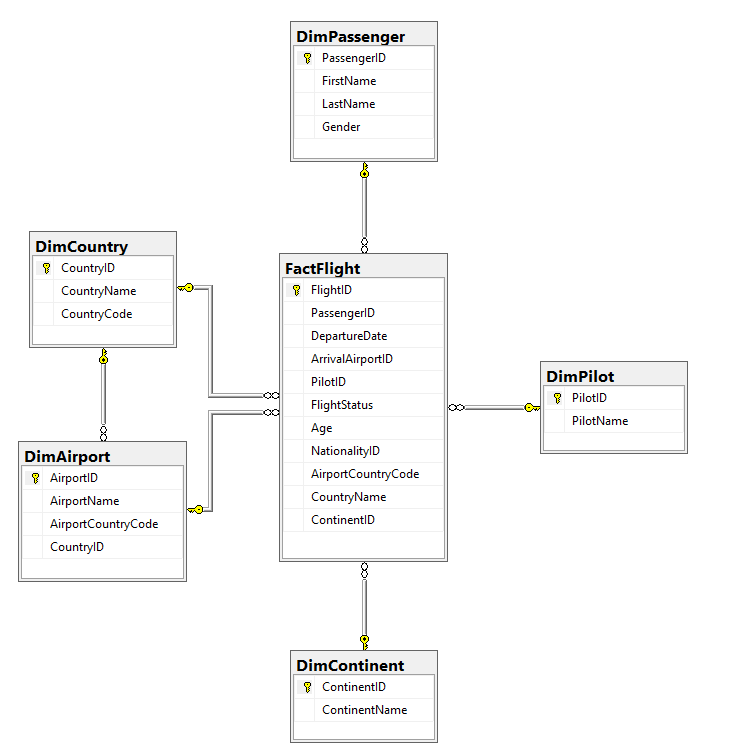

# Documentación del Proyecto ETL

## 1. Introducción

### 1.1 Descripción del Proyecto

Este proyecto tiene como objetivo implementar un proceso ETL (Extract, Transform, Load) utilizando SQL Server y Python para procesar datos de vuelos y pasajeros. Los datos se almacenan en un Datawarehouse diseñado con un modelo en estrella para facilitar la realización de consultas analíticas y la generación de reportes que permitan analizar la información de manera efectiva.

## 2. Justificación del Modelo

### 2.1 Modelo de Datos

El modelo de datos se ha diseñado utilizando el esquema de estrella (Star Schema), un enfoque común en la construcción de Datawarehouses debido a su simplicidad y eficiencia en la ejecución de consultas. El modelo consta de una tabla de hechos central y varias tablas de dimensiones que proporcionan contexto a los datos de los hechos.

- **Tabla de Hechos:**
  - **FactFlight**: Esta tabla almacena los eventos de los vuelos y contiene datos cuantitativos como la fecha de salida, el aeropuerto de llegada, el piloto, el estado del vuelo, y referencias a las dimensiones.

- **Tablas de Dimensiones:**
  - **DimPassenger**: Contiene información descriptiva de los pasajeros, como el ID, nombre, apellido y género.
  - **DimCountry**: Almacena los datos de los países, incluyendo el nombre y el código del país.
  - **DimAirport**: Detalla los aeropuertos con sus nombres y la referencia al país correspondiente.
  - **DimContinent**: Guarda los nombres de los continentes, que se utilizan para clasificar los aeropuertos por región.
  - **DimPilot**: Contiene los nombres de los pilotos.

### 2.2 Justificación de la Elección del Modelo

El modelo en estrella facilita la realización de consultas rápidas y la generación de reportes. Al conectar las tablas de dimensiones directamente con la tabla de hechos, se simplifica la extracción de información para análisis específicos, como el comportamiento de los vuelos en diferentes periodos, el análisis de pasajeros por género, y la identificación de los aeropuertos más concurridos, entre otros.

El uso de tablas de dimensiones bien definidas permite realizar análisis detallados desde diferentes perspectivas, como la nacionalidad de los pasajeros, el país de los aeropuertos de llegada, y las rutas más comunes según los pilotos. Este enfoque es particularmente adecuado para entornos donde se requiere un análisis rápido y preciso de grandes volúmenes de datos.

## 3. Manual Técnico

### 3.1 Descripción del Modelo

- **DimPassenger:**
  - **Descripción:** Almacena información básica de los pasajeros.
  - **Columnas:** `PassengerID`, `FirstName`, `LastName`, `Gender`.

- **DimCountry:**
  - **Descripción:** Contiene los datos de los países relacionados con los vuelos.
  - **Columnas:** `CountryID`, `CountryName`, `CountryCode`.

- **DimAirport:**
  - **Descripción:** Almacena los aeropuertos de destino de los vuelos.
  - **Columnas:** `AirportID`, `AirportName`, `AirportCountryCode`, `CountryID`.

- **DimContinent:**
  - **Descripción:** Contiene los nombres de los continentes.
  - **Columnas:** `ContinentID`, `ContinentName`.

- **DimPilot:**
  - **Descripción:** Guarda los nombres de los pilotos.
  - **Columnas:** `PilotID`, `PilotName`.

- **FactFlight:**
  - **Descripción:** Registra los vuelos, incluyendo referencias a las dimensiones relacionadas.
  - **Columnas:** `FlightID`, `PassengerID`, `DepartureDate`, `ArrivalAirportID`, `PilotID`, `FlightStatus`, `Age`, `NationalityID`, `AirportCountryCode`, `CountryName`, `ContinentID`.

### Diagrama

## 4. Procedimiento ETL

### 4.1 Extracción (Extract)

El proceso de extracción se inicia con la carga de datos desde un archivo CSV a una tabla temporal en SQL Server. Esta tabla temporal se utiliza para almacenar los datos crudos tal como se encuentran en el archivo. Se selecciona este enfoque para evitar la manipulación directa de los datos originales y para poder realizar operaciones de limpieza y transformación sobre una copia de trabajo.

### 4.2 Transformación (Transform)

Durante la fase de transformación, se realizan varias operaciones para limpiar y preparar los datos antes de cargarlos en las tablas definitivas:

- **Eliminación de Registros Duplicados:** Se identifican y eliminan los registros duplicados basándose en el ID del pasajero. Esto asegura que cada pasajero aparezca una sola vez en la tabla de dimensiones.
  
- **Eliminación de Registros Inválidos:** Se eliminan registros que contienen datos no válidos, como aeropuertos sin nombre válido o países con caracteres especiales no permitidos. Esta operación es crucial para mantener la integridad y coherencia de los datos.

- **Validación de Consistencia:** Se filtran y eliminan datos que no corresponden a los valores esperados, como continentes no reconocidos o códigos de país incorrectos. Este paso garantiza que los datos cargados en las tablas definitivas sean precisos y consistentes.

### 4.3 Carga (Load)

Una vez transformados y limpiados, los datos se cargan en las tablas definitivas del modelo:

- **Carga de Tablas de Dimensiones:** Primero se llenan las tablas de dimensiones con datos únicos. Por ejemplo, los datos de pasajeros se insertan en `DimPassenger`, y los aeropuertos en `DimAirport`. Cada entrada en las tablas de dimensiones es única y sirve para proporcionar contexto a los datos de la tabla de hechos.

- **Carga de la Tabla de Hechos:** Finalmente, se llena la tabla `FactFlight` con los datos procesados. Esta tabla incluye referencias a las claves primarias de las tablas de dimensiones, lo que permite realizar análisis complejos a través de estas relaciones.

## 5. Consultas Realizadas

### 5.1 Descripción de las Consultas

El proyecto incluye varias consultas SQL diseñadas para analizar los datos cargados en el modelo. Estas consultas se utilizan para obtener información clave sobre los vuelos y los pasajeros, como el conteo de registros, la distribución de pasajeros por género, y el ranking de los aeropuertos más utilizados.

### 5.2 Ejemplos de Consultas

- **Conteo de Registros por Tabla:** Se realiza un conteo del número de registros en cada tabla del modelo para verificar que la carga de datos se haya realizado correctamente.

- **Porcentaje de Pasajeros por Género:** Esta consulta calcula el porcentaje de pasajeros según su género, permitiendo un análisis demográfico de los pasajeros.

- **Vuelos por País:** Se agrupan y cuentan los vuelos por país de nacionalidad del pasajero, lo que permite identificar cuáles son los países con mayor tráfico aéreo.

- **Top 5 Aeropuertos con Mayor Número de Pasajeros:** Se identifican los cinco aeropuertos que han recibido el mayor número de pasajeros, proporcionando información valiosa sobre los principales hubs de tráfico aéreo.

## 6. Conclusiones y Lecciones Aprendidas

### 6.1 Resultados del Proyecto

El proceso ETL implementado ha demostrado ser eficaz para cargar y analizar los datos de vuelos y pasajeros. Las consultas ejecutadas sobre el modelo han permitido extraer información valiosa, como las tendencias de viajes según la nacionalidad y la popularidad de ciertos aeropuertos. Este análisis puede ser útil para la toma de decisiones estratégicas en el sector de la aviación.

### 6.2 Mejoras Futuras

Para futuras iteraciones del proyecto, se podrían considerar las siguientes mejoras:

- **Validación Adicional de Datos:** Implementar más controles de calidad durante la fase de transformación para detectar y corregir datos anómalos antes de la carga.
  
- **Optimización de Consultas:** Refinar las consultas SQL para mejorar su eficiencia, especialmente cuando se trate de volúmenes de datos más grandes.

- **Ampliación del Modelo:** Incluir dimensiones adicionales o modificar el esquema para permitir análisis aún más detallados, como la incorporación de datos de tiempo más específicos o la inclusión de variables relacionadas con el clima.

## 7. Instrucciones para la Ejecución

### 7.1 Requisitos Previos

- **Base de Datos SQL Server:** Debes tener acceso a una instancia de SQL Server donde se puedan crear las tablas del modelo.
- **Python 3.x:** Es necesario tener Python instalado, junto con las librerías necesarias para la conexión a la base de datos (`pyodbc`).

### 7.2 Pasos para la Ejecución

- 1. **Configurar la Conexión a la Base de Datos:** Antes de ejecutar el código, configura las variables de entorno con las credenciales de la base de datos SQL Server (nombre del servidor, base de datos, usuario y contraseña).

- 2. **Ejecución del Código Python:** Ejecuta el script Python principal que crea el modelo, carga los datos y realiza las consultas. Asegúrate

 de que los scripts SQL están correctamente vinculados en el código.

- 3. **Verificación de Resultados:** Una vez ejecutado el proceso ETL, revisa los resultados generados por las consultas para asegurarte de que los datos se han cargado correctamente y que el análisis es preciso.
